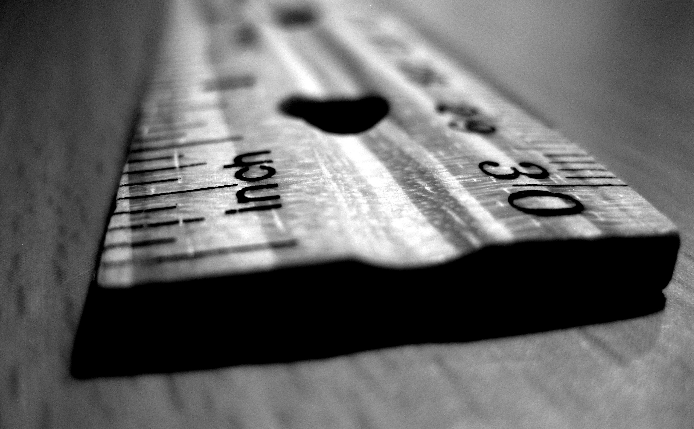

# How Many _This_ of _That_? 

# ~ ~ ~
## Units & conversion made easy.

----

# Want to know: 

- how many “G”s are in a meters-per-second-squared? 
- how many megameters in a parsec? 
- fathoms in a furlong? 

^ Plus, how should you model these values?

----

# Need to convert from:

- hours to picoseconds? 
- from troy ounces to carats? 

_You're about to find out how!_

----

# `Measurement`s, 
# `Unit`s, 
# & `Dimension`s, 
# _oh my!_

----

# In Foundation since iOS 10. 

> Label numeric quantities with physical dimensions to allow locale-aware formatting and conversion between related units.

- `https://developer.apple.com/documentation/foundation/units_and_measurement`

----

# Measurement 
## of a Dimension 
### in Units



[.footer: Image: https://flic.kr/p/7xWJEf]

----

# An Example

```Swift
let inFeet = Measurement(value: 600, 
						 unit: UnitLength.feet)
```

----

# An Example

```Swift
let inFeet = Measurement(value: 600, 
						 unit: UnitLength.feet)
```

"600.0 ft"

^ 
- How often should I have used this in my code?!?!
- Nice encapsulation; better than a raw variable...

----

# An Example (alternate syntax)

```Swift
let inFeet = Measurement<UnitLength>(value: 600, 
          							 unit: .feet)
```

^ The unit needs to be fully-qualified or specified generically, since there are too many Unit subtypes for Swift to infer `.feet` to mean `UnitLength.feet`.

----

# Converting


[.footer: Image: https://flic.kr/p/ogP2Tx]

----

# Converting

```Swift
let inMiles = inFeet.converted(to: UnitLength.miles)
let inMeters = inFeet.converted(to: UnitLength.meters)
```

----

# Converting

```Swift
let inMiles = inFeet.converted(to: UnitLength.miles)
let inMeters = inFeet.converted(to: UnitLength.meters)
```

"0.11363636363636363 mi"
"182.88 m"

^ Heck, there's entire apps in the store to convert things like this...

----

# Go Big, Go Small

```Swift
let inParsecs = inFeet.converted(to: UnitLength.parsecs)
let inInches = inFeet.converted(to: UnitLength.inches)
let inAstro = inFeet.converted(to: UnitLength.astronomicalUnits)
let inNanoMeters = inFeet.converted(to: UnitLength.nanometers)
```

"5.926737164535855e-15 pc"
"7200.0 in"
"1.2224772929204532e-09 ua"
"182879999999.99997 nm"

^ Or, should it be `inNanometers` instead?

----

# An Embarrassment of Dimensions

- Physical, Mass, Weight, Force
- Time, Motion
- Energy, Heat, Light, Electrical
- Concentration, Dispersion
- Fuel Efficiency
- Data Storage

^ UnitAcceleration, UnitAngle, UnitArea, UnitConcentrationMass, UnitDispersion, UnitDuration, UnitElectricCharge, UnitElectricCurrent, UnitElectricPotentialDifference, UnitElectricResistance, UnitEnergy, UnitFrequency, UnitFuelEfficiency, UnitIlluminance, UnitLength, UnitMass, UnitPower, UnitPressure, UnitSpeed, UnitTemperature, UnitVolume

----

# Physical Dimensions

- UnitArea
- UnitLength
- UnitVolume
- UnitAngle

^ Each of these has their various types!

----

# UnitArea

- squareMegameters, squareKilometers, squareMeters
- squareCentimeters, squareMillimeters, squareMicrometers, squareNanometers
- squareInches, squareFeet, squareYards
- squareMiles, acres, ares, hectares

^ 
- Not diving down into the others...
- liters, cubic inches, teaspoons, bushels...
- radians, arcSeconds, revolutions...

----

# Mass, Weight, and Force Dimensions

- UnitMass
- UnitPressure

^ 
- ounces, stones, carats, micrograms...
- millibars, poundsPerSquareInch, hectopascals...

----

# Time and Motion Dimensions

- UnitAcceleration
- UnitDuration
- UnitFrequency
- UnitSpeed

^ gravity, minutes, gigahertz, metersPerSecond...

----

# Energy, Heat, and Light Dimensions

- UnitEnergy
- UnitPower
- UnitTemperature
- UnitIlluminance

^
 - joules, kilowattHours, calories...
 - megawatts, horsepower...
 - kelvin, celsius (not 'centigrade'), fahrenheit (none of the others... 😔)
 - lux (only one; no conversions?)

----

# Electrical Dimensions

- UnitElectricCharge
- UnitElectricCurrent
- UnitElectricPotentialDifference
- UnitElectricResistance

^ ampereHours, coulombs, milliamperes, volts, ohms...

----

# Concentration and Dispersion Dimensions

- UnitConcentrationMass
- UnitDispersion

^ gramsPerLiter, partsPerMillion...

----

# Fuel Efficiency and Data Storage Dimensions

- UnitFuelEfficiency
- UnitInformationStorage

^ 
- Of course they go together!
- milesPerGallon, gigabytes, mebibits, nibbles, yottabits...

----

# Or, Make Your Own

> You can create a direct subclass of NSUnit to represent a custom dimensionless unit, such as a count, score, or ratio.

- https://developer.apple.com/documentation/foundation/unit

^ `LoyaltyPoints`? Then convert between merchants?

----

# UnitConverter

- Intended for subclassing.

> For units that can be converted by a scale factor or linear equation, use the concrete subclass UnitConverterLinear.

- https://developer.apple.com/documentation/foundation/unitconverter

_But, usually you can just do it as in the previous examples._

----

# Formatting


[.footer: Image: https://flic.kr/p/77XW6S]

----

# MeasurementFormatter

```Swift
let speed = Measurement<UnitSpeed>(value: 80.0, 
								   unit: .kilometersPerHour)
let formatter = MeasurementFormatter()
formatter.string(from: speed)
```

----

# MeasurementFormatter

```Swift
let speed = Measurement<UnitSpeed>(value: 80.0, 
								   unit: .kilometersPerHour)
let formatter = MeasurementFormatter()
formatter.string(from: speed)
```

"80.0 km/h"
"49.71 mph"

- Uses the preferred unit of the current Locale by default. 

----

# Delegates to NumberFormatter

So, you can also take advantage of its options.

```Swift
formatter.numberFormatter.usesSignificantDigits = true
formatter.numberFormatter.maximumSignificantDigits = 3
formatter.string(from: speed)
```

"49.7 mph"

----

# More Formatting

```Swift
formatter.unitOptions = [.providedUnit]
formatter.string(from: speed)
formatter.string(from: speed.converted(to: .knots))
```

"80 km/h"
"43.2 kn"

----

# More Formatting

```Swift
formatter.unitOptions = [.providedUnit]
formatter.string(from: inFeet.converted(to: .miles))
formatter.unitOptions = [.naturalScale]
formatter.string(from: inFeet.converted(to: .miles))
```

"0.114 mi"
"600 ft"

- There is also `.temperatureWithoutUnit`

^ Despite the explicit conversion, .naturalScale is more human-friendly.

----

# More Formatting

```Swift
formatter.unitStyle = .long
formatter.unitStyle = .medium
formatter.unitStyle = .short
```

"80 kilometers per hour"
"80 km/h"
"80km/h"

^ Old bug? Despite the conventions of certain locales, it will output "meters" instead of “metres”. (_this may be fixed now_)

----

# More Formatting

```Swift
formatter.unitStyle = .long
formatter.unitStyle = .medium
formatter.unitStyle = .short
```

"600 feet"
"600 ft"
"600′"

----

# "Unusual"-but-related Wiki Links _(for fun)_

- [List of unusual units of measurement ➚](https://en.wikipedia.org/wiki/List_of_unusual_units_of_measurement)
- [List of obsolete units of measurement ➚](https://en.wikipedia.org/wiki/List_of_obsolete_units_of_measurement)
- [List of humorous units of measurement ➚](https://en.wikipedia.org/wiki/List_of_humorous_units_of_measurement)

----

# Questions?
## _Answers?_

# ~ ~ ~
## Kevin Munc
## @muncman

